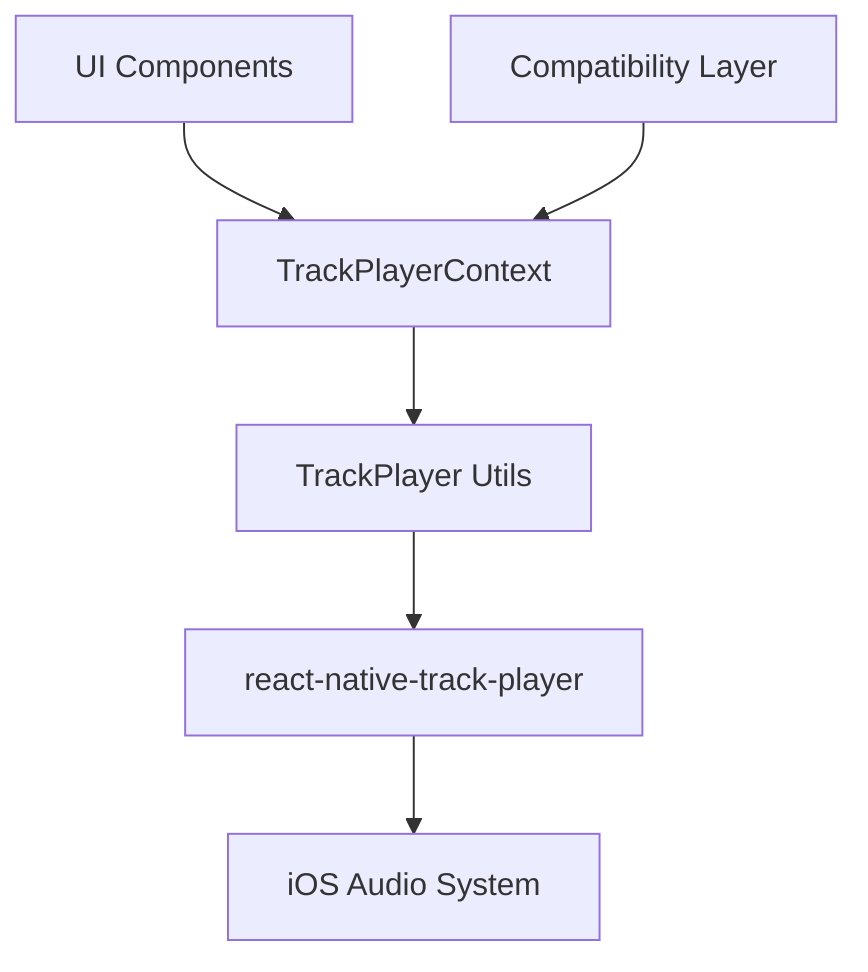
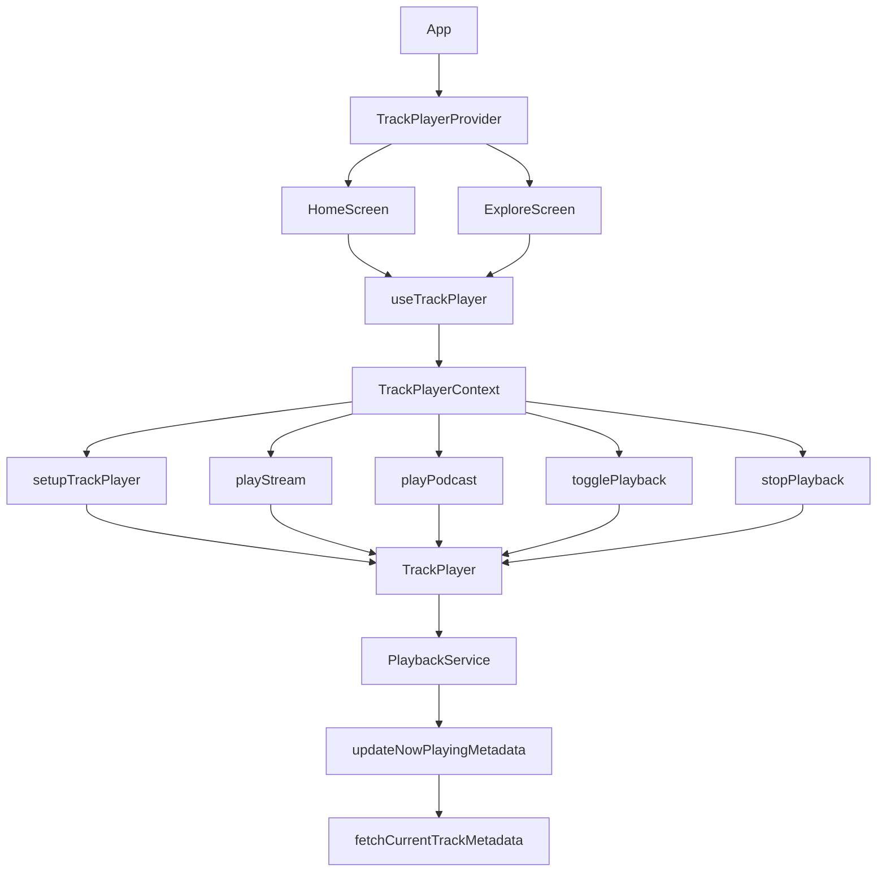

# NowPlayingTest System Patterns

## System Architecture

The NowPlayingTest project follows a layered architecture with clear separation of concerns:



### Key Components

1. **UI Components**: React Native components that provide the user interface for playback control.

2. **TrackPlayerContext**: React Context that provides state management and a simplified API for UI components.

3. **TrackPlayer Utils**: Utility functions that handle the interaction with react-native-track-player.

4. **react-native-track-player**: Native module that interfaces with the iOS audio system.

5. **Compatibility Layer**: Wrapper around TrackPlayerContext that maintains backward compatibility with the existing API.

## Design Patterns

### 1. Context Provider Pattern

The TrackPlayerContext uses the Context Provider pattern to make playback state and controls available throughout the component tree:

```typescript
// Context creation
const TrackPlayerContext = createContext<TrackPlayerContextType | undefined>(undefined);

// Provider component
export const TrackPlayerProvider: React.FC<{ children: React.ReactNode }> = ({ children }) => {
  // State and methods
  return (
    <TrackPlayerContext.Provider value={/* state and methods */}>
      {children}
    </TrackPlayerContext.Provider>
  );
};

// Custom hook for consuming the context
export const useTrackPlayer = () => {
  const context = useContext(TrackPlayerContext);
  if (!context) {
    throw new Error('useTrackPlayer must be used within a TrackPlayerProvider');
  }
  return context;
};
```

### 2. Module Singleton Pattern

The TrackPlayer service is registered once and tracked using a module-level variable:

```typescript
// Module-level state tracking
let isServiceRegistered = false;

// Register the playback service
const registerPlaybackService = async () => {
  if (isServiceRegistered) {
    console.log('PlaybackService already registered');
    return;
  }
  
  try {
    await TrackPlayer.registerPlaybackService(() => require('../utils/trackPlayerService').PlaybackService);
    isServiceRegistered = true;
  } catch (error) {
    console.error('Failed to register PlaybackService:', error);
  }
};
```

### 3. Adapter Pattern

The compatibility layer uses the Adapter pattern to adapt the new TrackPlayer API to match the old PlaybackContext API:

```typescript
// Compatibility methods with old names
const playLiveStream = async () => {
  return playerPlayLiveStream();
};

const playTrack = async (track) => {
  return playPodcast(track);
};

const dispatchPlayback = async (action) => {
  switch (action.type) {
    case 'PLAY_LIVE':
      return playerPlayLiveStream();
    case 'PLAY_PODCAST':
      return enqueueTrack(action.payload);
    // ...
  }
};
```

### 4. Observer Pattern

The TrackPlayer service uses the Observer pattern to listen for and react to playback events:

```typescript
TrackPlayer.addEventListener(Event.RemotePlay, async () => {
  try {
    await TrackPlayer.play();
  } catch (error) {
    console.error('Error in RemotePlay handler:', error);
  }
});

TrackPlayer.addEventListener(Event.PlaybackMetadataReceived, async (metadata) => {
  // Handle metadata updates
});
```

### 5. Factory Pattern

The TrackPlayer utilities use a Factory pattern to create track objects:

```typescript
// Create a stream track
const createStreamTrack = (metadata) => ({
  id: 'balearic-fm-stream',
  url: STREAM_URL,
  title: metadata?.title || 'Balearic FM',
  artist: metadata?.artist || 'Balearic FM',
  description: metadata?.description || 'Live radio stream',
  artwork: metadata?.artwork || DEFAULT_ARTWORK_URL,
  duration: 0,
  isLiveStream: true,
});

// Create a podcast track
const createPodcastTrack = (podcast) => ({
  id: podcast.id || `podcast-${Date.now()}`,
  url: podcast.enclosure?.['@_url'] || podcast.url,
  title: podcast.title || 'Unknown Episode',
  artist: podcast['itunes:author'] || podcast.artist || 'Balearic FM',
  artwork: podcast['itunes:image']?.['@_href'] || podcast.artwork || DEFAULT_ARTWORK_URL,
  duration: podcast.duration || 0,
  description: podcast.description || '',
});
```

## Key Technical Decisions

### 1. Modular File Structure

Decided to use a modular file structure to improve maintainability:

```
utils/
  trackPlayer/
    index.ts                  // Re-exports everything for easy imports
    setup.ts                  // Player setup and initialization
    metadata.ts               // Metadata fetching and handling
    playback.ts               // Core playback functions
    queue.ts                  // Queue management
    types.ts                  // Shared type definitions
    events.ts                 // Event handling
    service.ts                // Playback service implementation
  
context/
  TrackPlayerContext/
    index.tsx                 // Main context and provider
    hooks.ts                  // Custom hooks for accessing player features
    state.ts                  // State management
    compatibility.tsx         // Compatibility layer
```

### 2. Hybrid Naming Approach

Decided to use a hybrid naming approach for the migration:

- New namespace with similar function names
- Compatibility layer for backward compatibility
- Deprecation markers for old functions

### 3. Hybrid Queue Implementation

Decided on a hybrid approach for queue management:

- Use TrackPlayer's native queue for technical aspects
- Maintain a lightweight UI queue for visual feedback
- Preserve the user experience while simplifying the implementation

### 4. Metadata Structure Preservation

Decided to maintain the existing metadata structure:

- For live streams: Artist name goes in title field, song title in description
- For podcasts: Standard title/artist/description mapping

### 5. Error Handling Strategy

Implemented a comprehensive error handling strategy:

- Wrap all TrackPlayer operations in try/catch blocks
- Provide detailed error logging
- Implement graceful degradation for error cases
- Use defensive programming techniques to prevent errors

## Component Relationships



## Data Flow

1. **User Interaction**:
   - User interacts with UI components
   - UI components call methods from useTrackPlayer hook

2. **Context Layer**:
   - TrackPlayerContext processes the request
   - Updates local state
   - Calls appropriate utility functions

3. **Utility Layer**:
   - TrackPlayer utilities interact with the native module
   - Handle error cases
   - Return results to the context

4. **Native Module**:
   - react-native-track-player interacts with the iOS audio system
   - Emits events for playback state changes
   - Handles system audio controls

5. **Event Handling**:
   - PlaybackService listens for events from the native module
   - Updates metadata and state based on events
   - Triggers UI updates through the context
